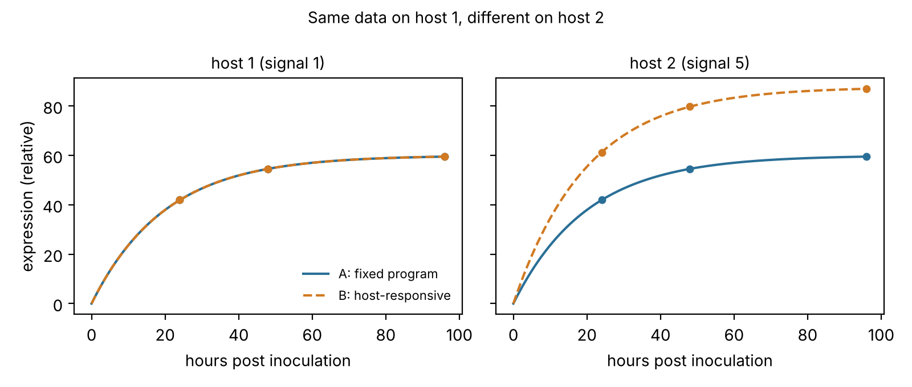

# logic_cell_model

Cell and molecule models of plant–pathogen interactions, built on the logic of
[*Deduction and Induction in One Diagram*](https://github.com/pupubear007/deductive-inductive-logic)
and checked in Lean 4. The quantitative models follow the topics of *Quantitative Fundamentals of
Molecular and Cellular Bioengineering* (Wittrup, Tidor, Hackel and Sarkar, MIT Press, 2020).

Hsuan Fu Wang, Department of Plant Pathology, University of Minnesota.

## The logic design, applied to cells

| Paper | Cell model |
|---|---|
| world `w ∈ W` | a cell mechanism: rate constants, or a regulatory structure |
| thought `φ : W → Prop` | a hypothesis about the cell ("turnover is fast", "the gene is host-responsive") |
| deduction `φ ⊨ ψ` | the mechanism hypothesis predicts a measurement |
| modus tollens (Prop 4.4) | a failed prediction eliminates the hypothesis |
| study and support `s ⟳ t` (Def 3.4) | the data leave the hypothesis open |
| assay `a : W → R` (Def 8.1) | an experimental design: mechanism ↦ what is measured |
| resolution (Thm 8.2) | the experiment can decide the hypothesis: every possible result entails it or rules it out |
| witness pair (Cor 8.3) | two mechanisms with the same data but different verdicts: no amount of this experiment decides the hypothesis |

## Proved in Lean (`lean/CellLogic`)

The Lean package depends on the paper's package `WangLogic` and uses its `Thought`, `Entails`,
`Resolves` and `modus_tollens` directly. There is no `sorry`, and every theorem uses at most the
axioms `propext`, `Classical.choice` and `Quot.sound` (`lean/AxiomCheck.lean`, checked in CI).

| Experiment | Cannot decide | Theorem | Can decide | Theorem |
|---|---|---|---|---|
| RNA-seq snapshot at steady state | whether turnover is fast | `snapshot_not_resolves_fast` | snapshot + transcription shutoff: everything | `snapshotShutoff_resolves` |
| expression on **one host** | fixed program vs host-responsive | `oneHost_not_resolves` | **two hosts** with different signals: everything | `twoHosts_resolves` |
| a difference between two hosts | — | — | eliminates the fixed program (deduction + modus tollens) | `fixedProgram_predicts_equal`, `fixedProgram_refuted` |
| enzyme rates at low substrate | the enzyme's affinity (Km) | `lowSubstrate_not_resolves` | rates at two substrate levels: everything | `twoSubstrates_resolves` |
| bulk (population) expression | whether expression is bursty | `bulk_not_resolves` | single-cell mean + variance: everything | `singleCell_resolves` |

Each non-resolution theorem exhibits an explicit witness pair. Each resolution theorem follows
from injectivity of the experiment (`resolves_of_injective`).

```sh
cd lean
lake exe cache get
lake build
lake env lean AxiomCheck.lean
```

## Computed in Python (`cellmodels`)

The Python package solves and simulates the same models, and `cellmodels.logic` implements the
paper's definitions (`entails`, `supported`, `resolves`, `witnesses`) for finite sets of worlds,
so the reasoning runs on real data where the worlds are isolates, samples or candidate
mechanisms. `tests/test_logic.py` checks each Lean theorem's statement on finite grids.

## Modules

| Module | Topic | Plant-pathology use |
|---|---|---|
| `binding` | receptor–ligand equilibrium and kinetics, ligand depletion | effector–target binding; AFM force spectroscopy later |
| `expression` | mRNA and protein dynamics, with closed forms and an ODE solver for time-varying input | dual RNA-seq time courses; expression driven by colonization |
| `identifiability` | witness pairs and local identifiability in log-parameters | which experiment determines which rate |
| `enzyme` | Michaelis–Menten rates, inhibition, integrated progress curves | secreted cell-wall-degrading enzymes |
| `regulation` | Hill functions, host-regulated expression, negative autoregulation | fixed program vs host-responsive regulation |
| `stochastic` | exact (Gillespie) simulation, constitutive and bursty expression, Fano factor | cell-to-cell variation; bulk vs single-cell data |
| `logic` | the paper's definitions for finite sets of worlds | resolution on real isolates and samples |
| `growth` | radial front, lag, logistic growth | radial growth, lesion expansion |
| `transport` | diffusion with first-order reaction: penetration length, Thiele modulus | how far a secreted acid reaches into tissue |
| `microfluidics` | Stokes (Poiseuille) flow, Reynolds, Péclet and Damköhler numbers, hydraulic resistance, wall shear stress | designing devices for spores, hyphae and roots |

Every module comes with an identifiability check in the tests:

| Measurement design | Determines only | Separated by |
|---|---|---|
| steady-state RNA-seq snapshot | synthesis / decay ratio | a time course, or transcription shutoff |
| mRNA data (any design) | mRNA rates | a protein-level measurement |
| enzyme initial rates at low substrate | kcat / Km | rates at and above Km |
| expression on one host | basal + induced transcription at that host's signal | a second host with a different signal |
| bulk (population-average) expression | burst frequency × burst size | single-cell variance (Fano factor) |

Planned next: fitting to real data (parameter estimation with confidence regions), run locally
against the lab's data and never committed here.

## Example: what RNA-seq can and cannot determine

```
$ python examples/01_rnaseq_identifiability.py
Snapshot gives the same value for both genes: True
Time course gives the same values:            False

Snapshot design:
rank 1 of 2 parameters
  unresolved direction: +1.00*log(alpha) +1.00*log(delta)

Time-course design:
rank 2 of 2 parameters (all identifiable)
```

A steady-state RNA-seq snapshot measures only the ratio of synthesis to decay. Doubling both
rates changes nothing in the data. A time course after induction, or a transcription shutoff,
separates them. The same check shows that mRNA data alone never determine protein translation
or turnover rates.


`examples/02_acid_penetration.py` shows how the consumption rate of a secreted acid decides
whether a whole leaf is exposed or only a surface layer.


`examples/03_host_responsive.py` applies this to the fixed-program versus host-responsive
question. Two explanations that agree at every time point on one host are separated by a second
host with a different signal level.



All parameter values in the examples are illustrative, not measured.

## Usage

```sh
pip install -e ".[dev]"
pytest -q
python examples/01_rnaseq_identifiability.py
python examples/02_acid_penetration.py
python examples/03_host_responsive.py
```

## Data

This repository is public and contains code and synthetic examples only. Experimental data stay
on the lab's storage and are read through local paths, never committed.
