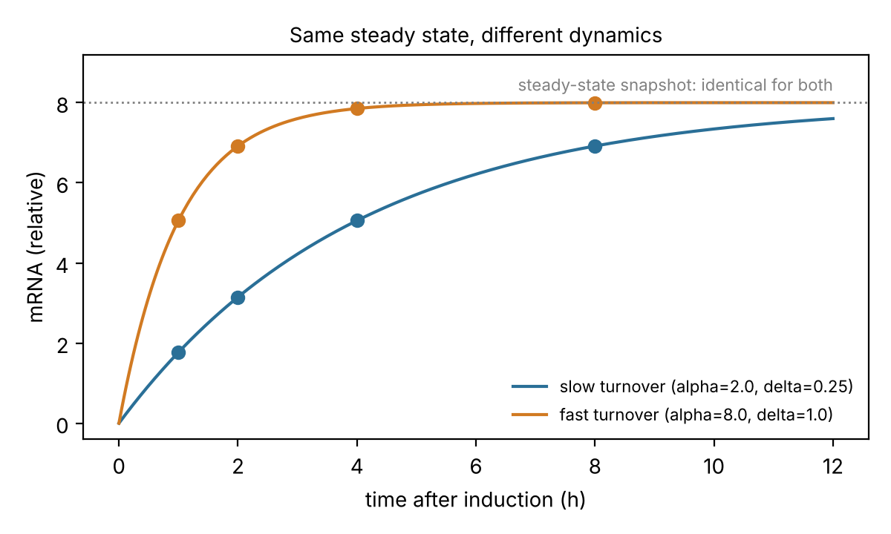
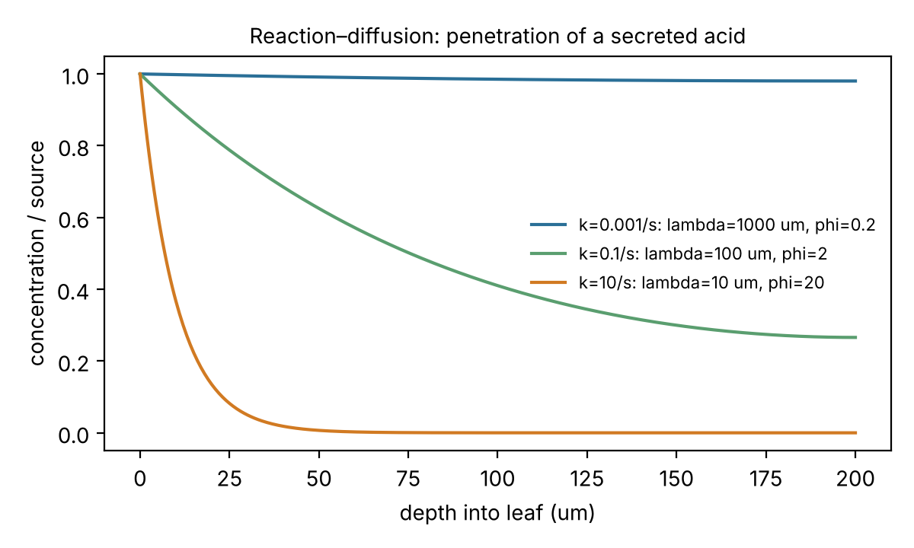

# logic_cell_model

Quantitative molecular and cellular models of plant–pathogen interactions, built topic by topic
along the lines of *Quantitative Fundamentals of Molecular and Cellular Bioengineering*
(Wittrup, Tidor, Hackel and Sarkar, MIT Press, 2020). Every model comes with the question of the
logic paper,
[*Deduction and Induction in One Diagram*](https://github.com/pupubear007/deductive-inductive-logic):
**what can a measurement tell apart?**

- *Deduction:* solve the model, from parameters to predicted measurements.
- *Induction:* fit the model, from measurements back to parameters.
- *Assay resolution (Theorem 8.2):* if two parameter sets give the same predicted
  measurements, no amount of that data can tell them apart. In modelling this is called
  identifiability. `cellmodels.identifiability` finds such cases and the combinations a design
  leaves free.

Hsuan Fu Wang, Department of Plant Pathology, University of Minnesota.

## Modules

| Module | Topic | Plant-pathology use |
|---|---|---|
| `binding` | receptor–ligand equilibrium and kinetics, ligand depletion | effector–target binding; AFM force spectroscopy later |
| `expression` | mRNA and protein dynamics, with closed forms and an ODE solver for time-varying input | dual RNA-seq time courses; expression driven by colonization |
| `identifiability` | witness pairs and local identifiability in log-parameters | which experiment determines which rate |
| `growth` | radial front, lag, logistic growth | radial growth, lesion expansion |
| `transport` | diffusion with first-order reaction: penetration length, Thiele modulus | how far a secreted acid reaches into tissue |
| `microfluidics` | Stokes (Poiseuille) flow, Reynolds, Péclet and Damköhler numbers, hydraulic resistance, wall shear stress | designing devices for spores, hyphae and roots |

Planned next, in this order: enzyme kinetics (cell-wall-degrading enzymes), network dynamics
(fixed program vs host-responsive regulation), stochastic processes (few-molecule and
few-isolate variation).

## Example: what RNA-seq can and cannot determine

```
$ python examples/01_rnaseq_identifiability.py
Snapshot gives the same value for both genes: True
Time course gives the same values:            False

Snapshot design:
rank 1 of 2 parameters
  unresolved direction: +1.00*log(alpha) +1.00*log(delta)

Time-course design:
rank 2 of 2 parameters (all identifiable)
```

A steady-state RNA-seq snapshot measures only the ratio of synthesis to decay. Doubling both
rates changes nothing in the data. A time course after induction, or a transcription shutoff,
separates them. The same check shows that mRNA data alone never determine protein translation
or turnover rates.



`examples/02_acid_penetration.py` shows how the consumption rate of a secreted acid decides
whether a whole leaf is exposed or only a surface layer.



All parameter values in the examples are illustrative, not measured.

## Usage

```sh
pip install -e ".[dev]"
pytest -q
python examples/01_rnaseq_identifiability.py
python examples/02_acid_penetration.py
```

## Data

This repository is public and contains code and synthetic examples only. Experimental data stay
on the lab's storage and are read through local paths, never committed.
